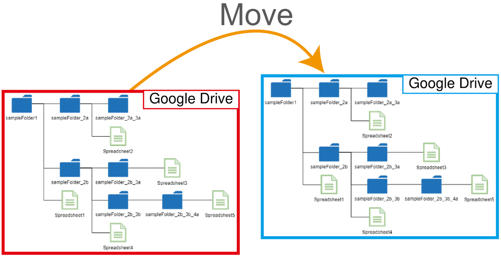

# MoveFolder

<a name="top"></a>
[](LICENCE)

<a name="overview"></a>



# Overview

This is a Google Apps Script library for moving a folder including files and folders on Google Drive.

# Description

This library addresses a common challenge: efficiently moving folders, including their subfolders and files, between Google Drives. This encompasses both personal and shared drives using a script. While Google Drive offers straightforward methods for moving individual files between any drives, directly moving entire folders containing subfolders presents limitations, particularly when shared drives are involved. This script bridges that gap by providing a reliable Google Apps Script solution for such scenarios.

Seeing a need, I created this script after receiving several requests. I believe it could be useful for other users, so I published it. If you find this helpful, I'm glad!

# IMPORTANT: Please read this before you test

- **This script automates moving folders and files within your Google Drive, including those in shared drives. Use caution when running the script, as it will modify your file structure.**
- **For safe testing, create a sample folder and populate it with some files. If you have a large number of folders and files, consider splitting them into smaller groups for individual testing. Unfortunately, limitations in my environment prevent me from comprehensively testing the script with massive amounts of data.**
- **Please note that we cannot assume any responsibility or liability for any damage or loss caused by this script. Use it at your own risk.**

# Issue and workaround

The report tackles the restriction of directly moving folders into or out of shared drives. When a direct move is attempted, the following error messages appear.

For Drive API

```
{
  "error": {
    "code": 403,
    "message": "Moving folders into shared drives is not supported.",
    "errors": [
      {
        "message": "Moving folders into shared drives is not supported.",
        "domain": "global",
        "reason": "teamDrivesFolderMoveInNotSupported"
      }
    ]
  }
}
```

For Drive service (DriveApp)

```
Exception: Cannot use this operation on a shared drive item.
```

It seems that this situation is the current specification. [Ref](https://issuetracker.google.com/issues/76201003) and [Ref](https://issuetracker.google.com/issues/207514843) This script in this report overcomes this limitation by employing a multi-step process:

1. **Retrieving Folder Structure**: It meticulously extracts the complete folder hierarchy from the source folder, capturing all subfolders at every level.
2. **Recreating Folder Structure**: Leveraging the retrieved information, the script meticulously replicates the entire folder structure within the destination drive.
3. **File Movement**: Individual files are efficiently transferred from the source folder to their corresponding locations within the newly created folder structure in the destination drive.
4. **Source Folder Removal (Optional)**: Once the files are safely relocated, the script can optionally remove the original source folder to ensure a clean and organized workspace.

By meticulously following these steps, the script effectively migrates entire folders, including subfolders and files, between any Google Drives, regardless of whether they are personal or shared drives. This report delves into the details of this Google Apps Script, providing a step-by-step explanation of its functionality and implementation.

In the above process, the folder IDs are changed because the folder structure is created for the destination folder while the file IDs are not changed.

# Usage

## 1. Create a Google Apps Script project

In this report, Google Apps Script is used. Of course, the approach introducing this report can also be used in other languages.

Here, in order to test the following sample scripts, please create a standalone Google Apps Script project. Of course, this script can also be used with the container-bound script.

And, please open the script editor of the Google Apps Script project.

## 2. Install a Google Apps Script library

When I created a script for this, the script was a bit complicated. So, in order to easily use this script, I created it as a Google Apps Script library. Of course, you can see the actual script of this library at [my repository](https://github.com/tanaikech/MoveFolder).

## Library's project key

```
1UEyIfxDTat6GYRFy5iJ3UGj2QpyVuuQI5i-BsOcHDMr8HadIWailwj4k
```

<a name="Howtoinstall"></a>

## How to install

### Pattern 1: Install this as a Google Apps Script library

In order to use this library, please install this library.

1. [Install BatchRequest library](https://developers.google.com/apps-script/guides/libraries).
   - Library's project key is **`1UEyIfxDTat6GYRFy5iJ3UGj2QpyVuuQI5i-BsOcHDMr8HadIWailwj4k`**.
1. For APIs you want to use, please enable the APIs at API console.
   - Recently, when it enabled APIs, I had an experience that I was made to wait for several minutes for enabling APIs. So when you enabled APIs at API console, if the error related to APIs occurs, please run again after several minutes.

This library uses the following 2 scopes.

- `https://www.googleapis.com/auth/drive`
- `https://www.googleapis.com/auth/script.external_request`

Also, this library also uses my library [BatchRequest](https://github.com/tanaikech/BatchRequest).

> But, in the recent update on the Google side, it was found that in the current stage, when the other libraries are loaded from a library, an error like `We're sorry, a server error occurred while reading from storage. Error code NOT_FOUND` occurs. So, from v1.0.1, the library of BatchRequest is included in this library.

### Pattern 2: Install this by directly copying and pasting this script

Of course, when you want to directly use the script of this library without installing the library, you can also achieve it. In that case, please do the following steps.

1. Copy and paste [the script](https://github.com/tanaikech/MoveFolder/blob/master/MoveFolder.js) from the repository to your script editor.
2. Install a Google Apps Script library of [BatchRequest](https://github.com/tanaikech/BatchRequest). In this script, in order to move all files with a low process cost, the batch request is used.
3. When you use this script, you can also use it as `MoveFolder.run({ srcFolderId, dstFolderId })`.

## 3. Enable Drive API

This script uses Drive API. So, please enable Drive API at Advanced Google services. [Ref](https://developers.google.com/apps-script/guides/services/advanced#enable_advanced_services)

## 4. Sample script

After the library is installed and Drive API is enabled, you can test this script. Please copy and paste the following script to the script editor installing the library.

Please set the source folder ID and the destination folder ID.

```javascript
function myFunction() {
  const srcFolderId = "###";
  const dstFolderId = "###";
  MoveFolder.run({ srcFolderId, dstFolderId });
}
```

When you run the function `myFunction`, the folder of the folder `srcFolderId` is moved to the folder `dstFolderId`.

## 5. Options of this library

This library has the simple options. These can be used in the object of the argument of `run` method.

- `srcFolderId`: Folder ID of the source folder.
- `dstFolderId`: Folder ID of the destination folder.
- `accessToken`: Default is `ScriptApp.getOAuthToken()`. For example, when you want to use the service account, you can use the access token from the service account.
- `forSharedDrive`: Default is false. When this is true, the process mentioned in the "Issue and workaround" section is forcibly run.

# Reference

- [MoveFolder](https://github.com/tanaikech/MoveFolder)

---

<a name="licence"></a>

# Licence

[MIT](LICENCE)

<a name="author"></a>

# Author

[Tanaike](https://tanaikech.github.io/about/)

[Donate](https://tanaikech.github.io/donate/)

<a name="updatehistory"></a>

# Update History

- v1.0.0 (June 6, 2024)

  1. Initial release.

- v1.0.0 (June 10, 2024)

  1. By email from kindly users, I could notice that permission for this library has been canceled. I'm worried that this might be my misoperation. I apologize for this situation. So, I updated permission to read the library. Please confirm whether you can install this library by the library project key `1UEyIfxDTat6GYRFy5iJ3UGj2QpyVuuQI5i-BsOcHDMr8HadIWailwj4k` again.

- v1.0.1 (June 18, 2024)

  1. In the recent update on the Google side, it was found that in the current stage, when the other libraries are loaded from a library, an error like `We're sorry, a server error occurred while reading from storage. Error code NOT_FOUND` occurs. So, from v1.0.1, the library of BatchRequest is included in this library.

- v1.0.2 (June 18, 2024)

  1. I forgot to update `appsscript.json`. In this version, it was updated.

[TOP](#top)
