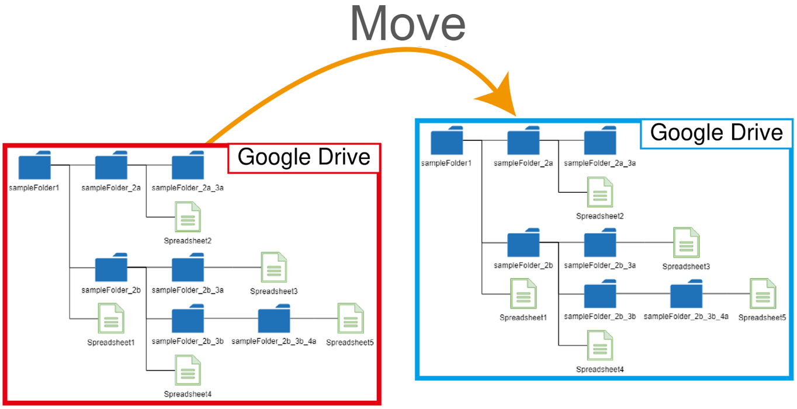

# MoveFolder

<a name="top"></a>
[](LICENCE)

<a name="overview"></a>



# Overview

This is a simple and powerful Google Apps Script library for moving an entire folder—including all of its subfolders and files—from one location to another on Google Drive.

# Description

Moving a single file in Google Drive is easy. However, moving **entire folders with deep subfolders**, especially into or out of Shared Drives, can be very tricky and often causes errors.

This library solves that problem. It perfectly replicates your folder structure in the new location and safely moves all your files over. Whether you are organizing your personal Drive or managing team files in Shared Drives, this script makes bulk folder movement simple and reliable.

# IMPORTANT: Please read this before you start

- **Modifies your Drive:** This script will actually move folders and files within your Google Drive. Please be careful, as it directly modifies your file structure.
- **Test first:** Always test the script safely before moving your important data. We provide a `test.js` script to help you try it out without risking your actual files (see the "How to Test" section below).
- **Use at your own risk:** We cannot assume any responsibility or liability for any damage, data loss, or other issues caused by this script.

# Why do you need this script? (Issue & Workaround)

If you try to move a folder directly into a Shared Drive using Google Apps Script (like using `DriveApp` or standard Drive API), you will get an error saying:

```json
{
  "error": {
    "code": 403,
    "message": "Moving folders into shared drives is not supported."
  }
}
```

To bypass this Google limitation, this script does the following automatically:

1. **Reads the structure:** It scans the original folder to learn how all subfolders and files are organized.
2. **Recreates the folders:** It builds the exact same folder structure in the destination drive.
3. **Moves the files:** It moves every single file from the old folders to the newly created matching folders.
4. **Cleans up:** If (and only if) everything moved successfully without any errors, it deletes the empty original folders.

_(Note: File IDs stay exactly the same, but Folder IDs will change because new folders are created in the destination.)_

# Usage

## Step 1: Create a Google Apps Script project

Go to [Google Apps Script](https://script.google.com/) and create a new project. Open the script editor.

## Step 2: Install this Library

You can use this script in two ways.

### Method A: Install as a Library (Recommended)

1. Click on the plus (`+`) icon next to **Libraries** in the left menu.
2. Enter the Project Key: **`1UEyIfxDTat6GYRFy5iJ3UGj2QpyVuuQI5i-BsOcHDMr8HadIWailwj4k`**
3. Select the latest version and click **Add**.

_(Note: This library also uses the `BatchRequest` library internally to move files quickly. From v1.0.1, it is fully included inside MoveFolder, so you do not need to install `BatchRequest` separately!)_

### Method B: Copy and Paste directly

If you prefer not to use it as an attached library:

1. Copy the code from `MoveFolder.js` in this repository and paste it into a new file in your script editor.
2. You will also need to copy the code from `BatchRequest.js` into your project.

## Step 3: Enable the Drive API

This script requires the advanced Drive API to function.

1. Click on the plus (`+`) icon next to **Services** in the left menu.
2. Find **Drive API** in the list.
3. Click **Add**.

## Step 4: Write your script

Copy and paste the following sample code into your script editor. Replace the `###` with your actual folder IDs.

```javascript
function myFunction() {
  const srcFolderId = "###"; // The ID of the folder you want to move
  const dstFolderId = "###"; // The ID of the place you want to move it to

  // Run the move process
  MoveFolder.run({ srcFolderId: srcFolderId, dstFolderId: dstFolderId });
}
```

_Tip: You can find a Folder ID by opening the folder in Google Drive and looking at the URL: `https://drive.google.com/drive/folders/[THIS_IS_THE_ID]`_

## Step 5: Advanced Options

You can pass additional options into the `run` method by adding them to the object:

- `srcFolderId` (Required): The ID of the folder to move.
- `dstFolderId` (Required): The ID of the destination folder.
- `accessToken` (Optional): The authorization token. It uses `ScriptApp.getOAuthToken()` by default. You can change this if you are using Service Accounts.
- `forSharedDrive` (Optional): Default is `false`. If you set this to `true`, the script will forcefully use the complex recreation method even if you are not moving into a Shared Drive.

# How to Test (`test.js`)

To safely verify that this library works in your environment without risking your actual files, we have provided a **`test.js`** file in the root directory of this repository.

### What `test.js` does:

1. Automatically creates temporary "Source" and "Destination" folders in your Drive.
2. Creates a sample subfolder and fake text files inside the Source folder.
3. Retrieves the folder structure, then runs the `MoveFolder` script.
4. Compares the structure before and after to prove the move was 100% accurate.
5. **Automatically deletes** all temporary folders and files when finished, leaving your Drive clean.

### How to run the test:

1. Copy the code from `test.js` into your Apps Script project.
2. Ensure you have enabled the Drive API (Step 3).
3. Select and run the `testMoveFolder()` function from the editor toolbar.
4. Check the Execution Log to see the step-by-step progress and confirmation of success!

# Reference

- [MoveFolder](https://github.com/tanaikech/MoveFolder)

---

<a name="licence"></a>

# Licence

[MIT](LICENCE)

<a name="author"></a>

# Author

[Tanaike](https://tanaikech.github.io/about/)

[Donate](https://tanaikech.github.io/donate/)

<a name="updatehistory"></a>

# Update History

- v1.0.3 (May 06, 2026)
  1. Refactored the core script for better performance, safety, and readability.
  2. Enhanced error handling: The script now strictly verifies if file moves were successful before deleting any original source folders, preventing accidental data loss if permission errors occur.
  3. Introduced parallel processing using `UrlFetchApp.fetchAll` for much faster folder structure retrieval and folder creation.
  4. Added a standalone test script (`test.js`) to allow safe, automated validation of the library's functionality.
  5. Updated the README documentation to make it more beginner-friendly and easier to follow.

- v1.0.2 (June 18, 2024)
  1. I forgot to update `appsscript.json`. In this version, it was updated.

- v1.0.1 (June 18, 2024)
  1. In the recent update on the Google side, it was found that in the current stage, when the other libraries are loaded from a library, an error like `We're sorry, a server error occurred while reading from storage. Error code NOT_FOUND` occurs. So, from v1.0.1, the library of BatchRequest is included in this library.

- v1.0.0 (June 10, 2024)
  1. By email from kindly users, I could notice that permission for this library has been canceled. I'm worried that this might be my misoperation. I apologize for this situation. So, I updated permission to read the library. Please confirm whether you can install this library by the library project key `1UEyIfxDTat6GYRFy5iJ3UGj2QpyVuuQI5i-BsOcHDMr8HadIWailwj4k` again.

- v1.0.0 (June 6, 2024)
  1. Initial release.

[TOP](#top)
